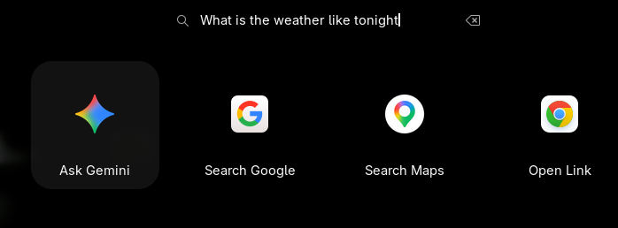

# Search Provider - Gnome Search
This extension adds a Chrome search provider to Gnome Search

When searching you get the option to:
- Ask Gemini eg. "Why is fuel so expensive?"
- Search Google eg. "Local fuel prices"
- Search Maps eg. "Directions to closest fuel station"
- Open Link eg. "Amazon.com" 

Using the Gnome extension settings menu: 
- Toggle which google capabilities are enabled.
- Get help on how to use the search provider.

# TODO
Folllowing items outstanding:
- Add YouTube (https://www.youtube.com/)
- Add Google News (https://news.google.com/search?q=Latest)
- Add Google Shopping (https://www.google.com/search?q=Latest&tbm=shop)
